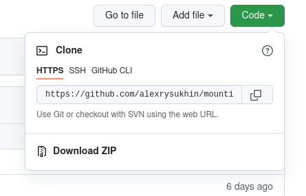

# The mountains  (*recommend on the big screen*)


## My portfolio site.  
## Not completed **yet** 
## But it works
## )
____


# To download from the repository you need...

+ ### Copy repository link




+ ### Open the folder where you are going to clone the object

+ ### Open terminal in this folder

+ ### Write in terminal:  ` $git clone` and paste the copied link

```
$ git clone https://github.com/alexrysukhin/mountins.git

```
____
# To run on a local machine, you need...

+ ### Enter the command in the terminal :

```
$ cd mountins
```
+ ### Enter the command :
```
$ git checkout nodeJsVersion
```

+ ### Enter the command :


```
$ npm run server
```
____
# To run in a browser you need ...

+ ### Go to browser

+ ### Go to address: `http://localhost:3000/`